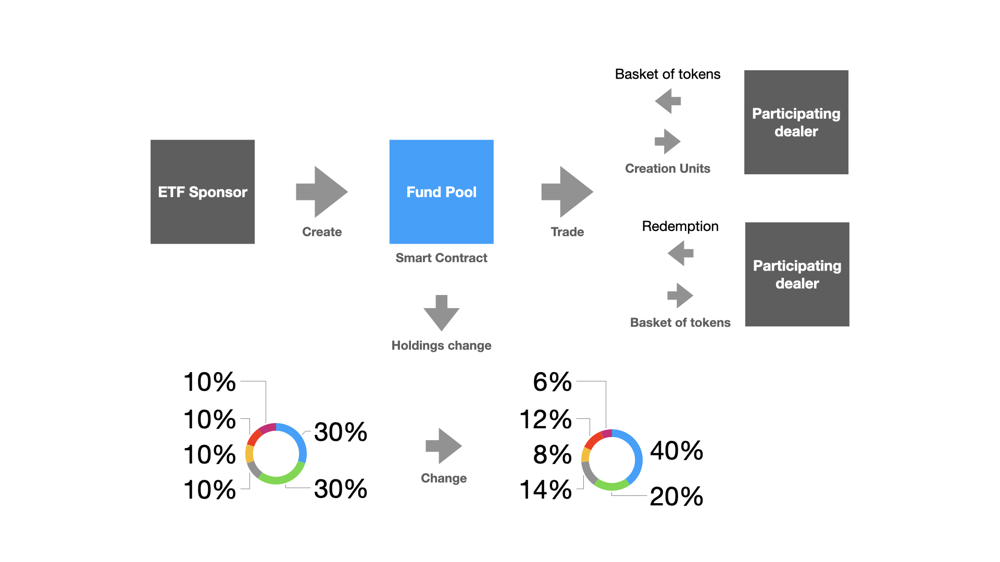

# DeETF Protocol

We create DeETF protocol for fund manager and PD to issue their ERC20-Compatible fund, which can be traded on any DEX. It is based on AFM (Automated Fund Maker), which is autonomous trading mechanism.

:mage: **This project is built for Chainlink Fall Hackathon 2021, but will launch a live product in the future.

## Inspiration

It's inspired by ETF on the market. There are 7000+ notable tokens issued on crypto market. Many tokens are worth for users to invest. Our idea primary helps users to take less time, cost (gas fee) and risks to earn more revenue. It's also more faster and efficient than off-chain ETF.

## What it does

The DeETF protocol has 4 important features implemented on the smart contract. It can be fully managed by smart contract through the interactions of participants.

* Unit creation
* Redemption
* Holdings change
* On-chain NAV (Chainlink data feeds)

The diagram shows below for explanation

## How we built it

There are two smart contracts to interoperate with fund.

* FundFactory - Create fund pool.
* FundPool - Manage fund for unit creation, redemption & holdings change.

For fund movement, take into deep consideration for 3 points below.

* permission - only fund manager can change holdings
* duplicate - use symbol to prevent multiple same tokens on the market
* security - keep track of unit creation. If holdings change, PD can still redeem correct amounts for basket of tokens.

## Challenges we ran into

At initials, our logic is more complicated to create fund pools. After discussing and brainstorming, we change our way to keep it simple.

## Accomplishments that we're proud of

We build the most effective method to help users to create their funds and also make it safe with other participants.

## What we learned

What we learned is hackathon experience. Our team members first join this game for creativity.

## What's next for

We list our next steps for this project.

* Governance - users can vote to add more tokens into ETF
* Staking - stake to share with protocol fees
* Variety of ETFs - Inverse ETF, Derivative ETF & ETF Futures and Options

## Contact

* Telegram: @ja3es
* WeChat: james_chien_tw
